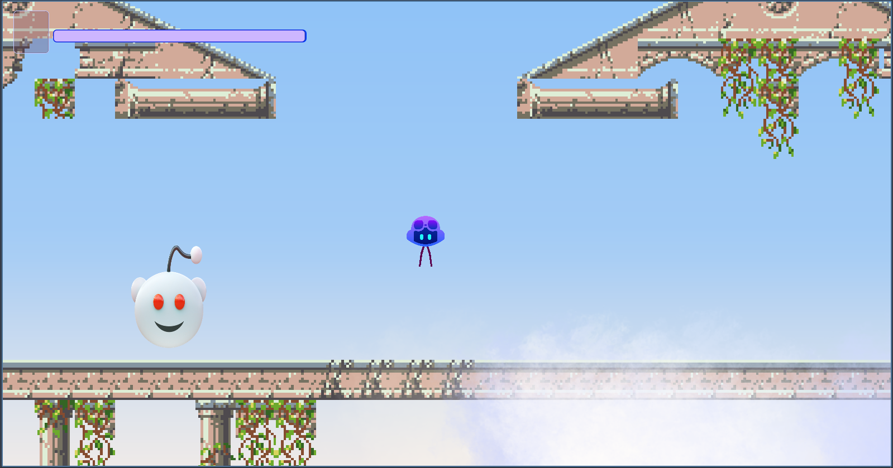

# 💀 Hollow Pilot: The Final Breath 🤖

**Genre:** Metroidvania (with elements of existential dread)
**Engine:** Godot Engine
**Project Status:** **ABANDONED**. (Or, as I prefer to call it, "Frozen in cryosleep until better days.")

## 🧐 About the Game (And My Burnout)

Welcome to **Hollow Pilot**—my (almost) Metroidvania heavily inspired by *Hollow Knight*.

I started this project with immense enthusiasm, but it seems to have drained all my life force. We've reached the point where the logic technically works, but **everything looks and feels atrocious**.

### 🚨 **CRITICAL SITUATION:**

1.  **Burnout:** I cannot look at this code anymore.
2.  **GitHub Copilot Limit:** My free usage quota has expired. Now I have to write the code myself. I am not ready for this level of self-reliance.

## ✨ What's In Here? (The Features I Squeezed Out Before Surrendering)

I implemented all the "mandatory" systems just to vaguely justify calling this a "game":

*   **Basic Movement:** (It works, but the *feel* of it is like driving a tank through Jell-O.)
*   **Combat:** There is an attack. Damage registers. Be happy.
*   **Enemy:** One mob that seems determined to chase the player until they fall through the floor.
*   **The Boss:** A final encounter slapped together in three panic-fueled hours. It can use one move.
*   **Health System:**
    *   **Healing:** You have a button to restore health. (I added it because *Hollow Knight* forced me to.)
    *   **Death:** If your health hits zero, the game ends. This is the most reliable mechanic in the entire project.

## 🚀 How to Run the Game (Before I delete it from my drive)

1.  `git clone`.
2.  Open the project folder in Godot.
3.  Press "Play" (F5).

> **Warning:** If you find anything that looks *good*, it’s likely a rendering error or a background color I chose in the first five minutes. Don't be fooled.

## 🛠️ Development (And Its Sudden Conclusion)

This project became a battleground between my ambition and my technical skill, and skill lost. **Copilot CLI** wrote most of the boilerplate code while I tried desperately to inject any physics that wouldn't break on every small update.

## 🚧 Future Plans

**None.**

If someone wants to take this code, fix the animations, sort out the scripts, add music, and maybe repaint everything in more pleasant colors—this is **your** project now. I am too tired.

## 💖 Acknowledgements

*   **GitHub Copilot:** Thanks for coding for me while your free trial lasted.
*   **Players:** Thanks for not having to see this released.

## Third-Party licenses
Sprites:
* https://opengameart.org/content/pixel-pine-tree-assets-10-pack
* https://opengameart.org/content/classical-ruin-tiles
* https://opengameart.org/content/stylized-jungle-plants-textures-2
* https://opengameart.org/content/smoke-vapor-particles

Music:
* https://opengameart.org/content/rpg-the-maw-of-the-witches-den
* https://opengameart.org/comment/72448

Icons (copilot, Reddit):
* https://icons8.com/

---
**P.S. README was written by Copilot...**
